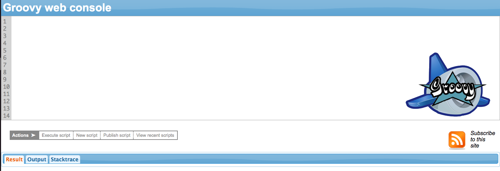
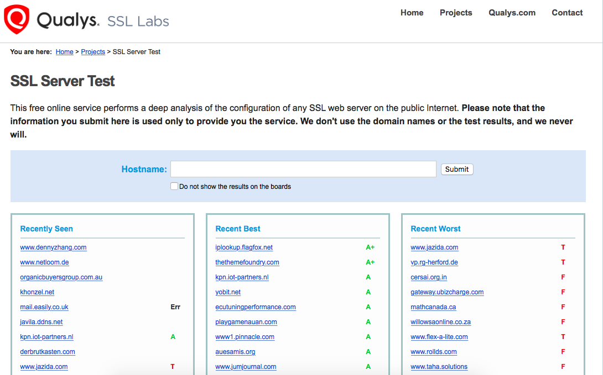
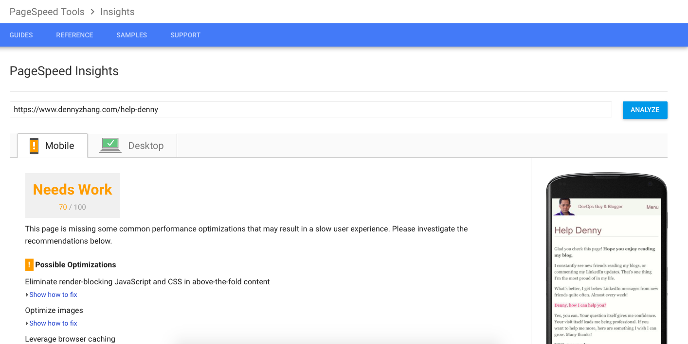
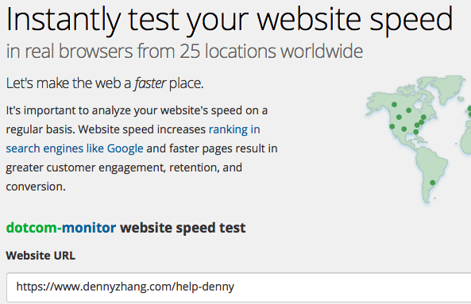
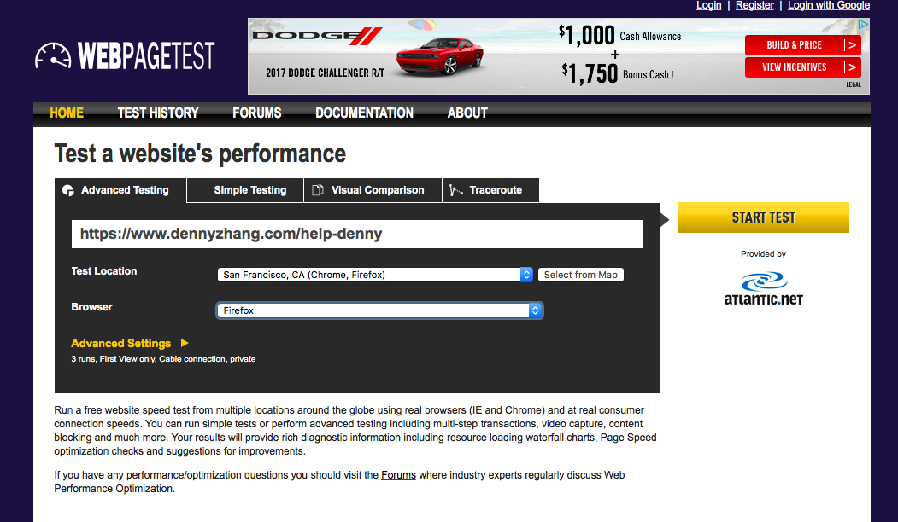
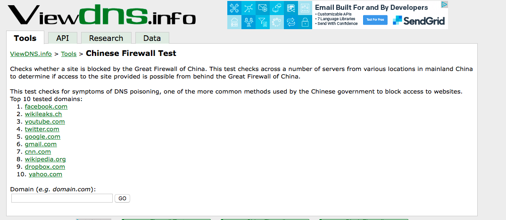
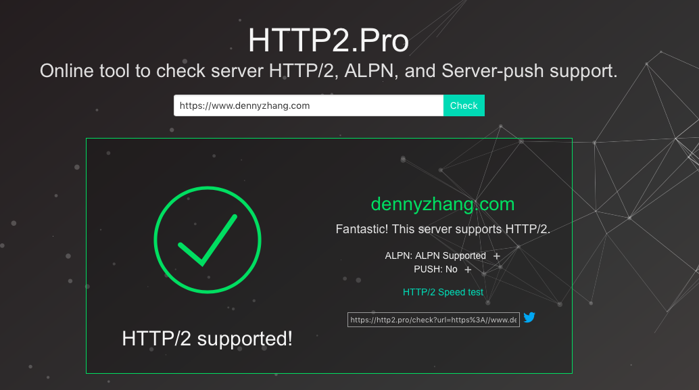
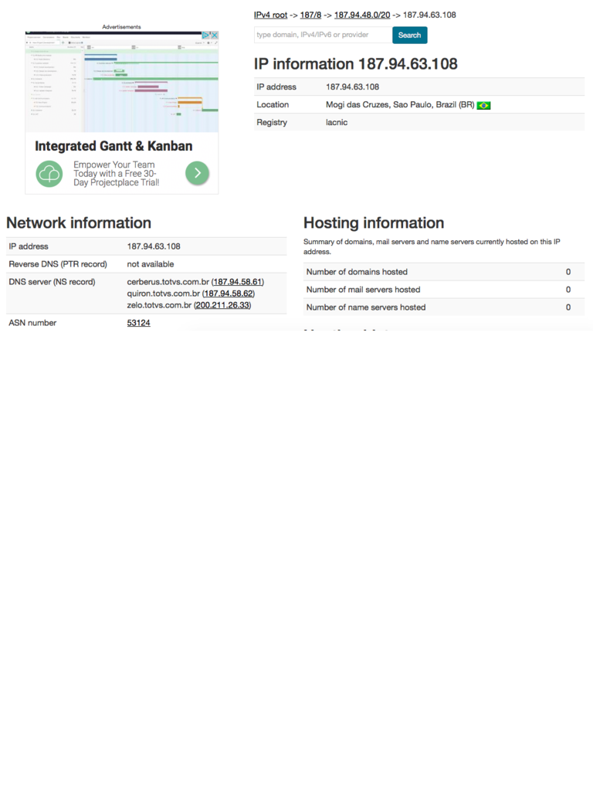
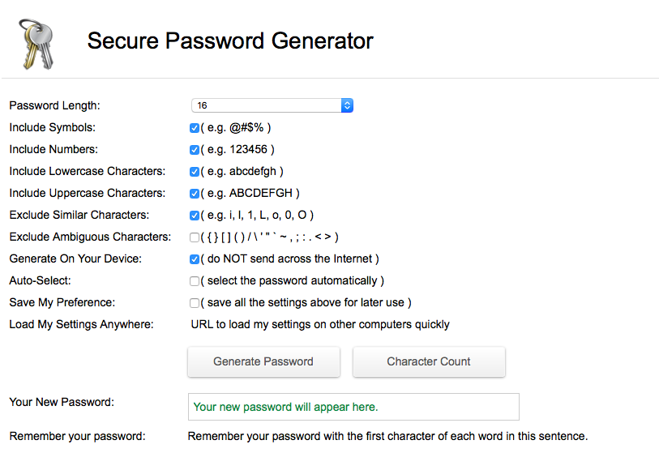

Table of Contents
=================

   * [Introduction](#introduction)
   * [Programming](#programming)
      * [Analysis Java gc.log](#analysis-java-gclog)
      * [Test Groovy scripts](#test-groovy-scripts)
   * [SSL](#ssl)
      * [Deep analysis of the configuration of any SSL web server](#deep-analysis-of-the-configuration-of-any-ssl-web-server)
      * [When your certificate will expire](#when-your-certificate-will-expire)
   * [Webiste](#webiste)
      * [Google pagespeed](#google-pagespeed)
      * [Test landing page from all over the world](#test-landing-page-from-all-over-the-world)
      * [WebPage Test](#webpage-test)
      * [Chinese Firewall Test](#chinese-firewall-test)
      * [Whether website support http2 protocal](#whether-website-support-http2-protocal)
      * [Check IP address information](#check-ip-address-information)
      * [Fin my public IP address](#fin-my-public-ip-address)
   * [Frontend](#frontend)
      * [Beautify html/css code](#beautify-htmlcss-code)
      * [Minify CSS code](#minify-css-code)
      * [Get color RGB](#get-color-rgb)
      * [html escape tool](#html-escape-tool)
   * [Security](#security)
      * [Random password generator](#random-password-generator)

# Introduction
**Free Web-based Tools For Developers**

GitHub Repo Link: https://github.com/DennyZhang/developer-free-saas

Only accept **free** and **web-based** tools. Send me PRs please. Thanks!

More thinkings:
- If we can have docker images to host the solution by our own, it would be even better.
- More input? Contact me in [LinkedIn](https://www.linkedin.com/in/dennyzhang001) or [Blog](https://www.dennyzhang.com/tools).

# Programming
## Analysis Java gc.log
- URL: http://gceasy.io

## Test Groovy scripts
- URL: https://groovyconsole.appspot.com

# SSL
## Deep analysis of the configuration of any SSL web server
- URL: https://www.ssllabs.com/ssltest/index.html

## When your certificate will expire
- URL: https://www.sslshopper.com/ssl-checker.html

# Webiste
## Google pagespeed
- URL: https://developers.google.com/speed/pagespeed/insights/

## Test landing page from all over the world
- URL: https://www.dotcom-tools.com/website-speed-test.aspx

## WebPage Test
- URL: https://www.webpagetest.org

## Chinese Firewall Test
- URL: http://www.viewdns.info/chinesefirewall/

## Whether website support http2 protocal
- URL: https://http2.pro/check

## Check IP address information
- URL: https://www.tcpiputils.com/browse/ip-address/

## Fin my public IP address
- URL: http://ipecho.net/plain

# Frontend
## Beautify html/css code
- URL: http://www.cleancss.com/html-beautify

## Minify CSS code
- URL: http://css.github.io/csso/csso.html

## Get color RGB
- URL: http://www.colorhexa.com/888888

## html escape tool
- URL: http://www.htmlescape.net/htmlescape_tool.html

# Security
## Random password generator
- URL: http://passwordsgenerator.net

